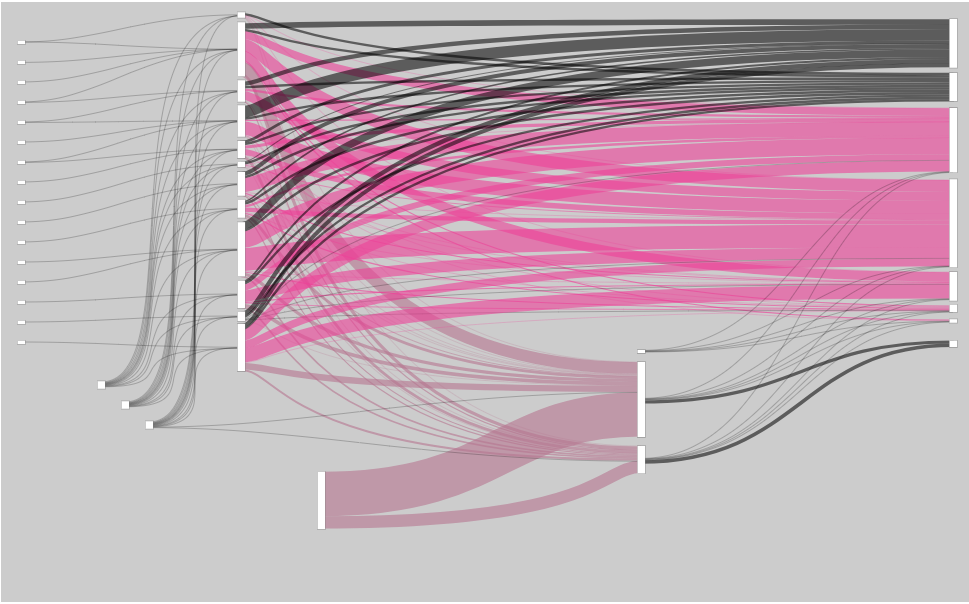
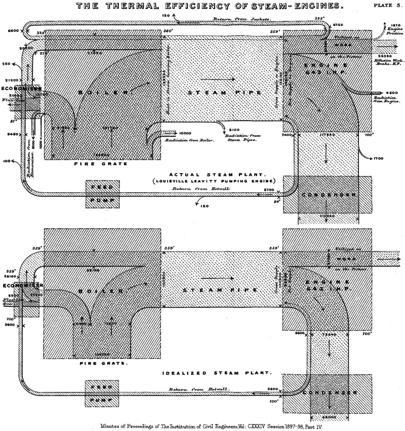
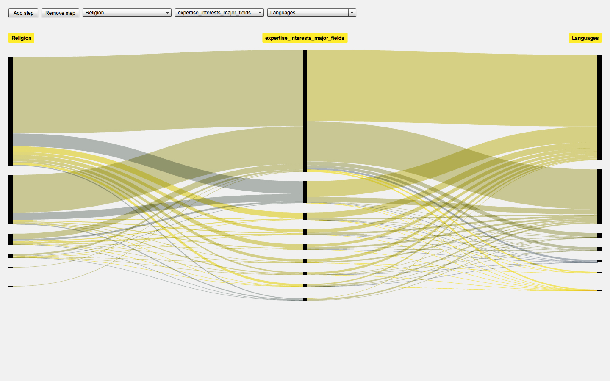

# Readme!

### Universidad Autónoma Metropolitana

## Flujo de Residuos Sólidos Urbanos

La visualiación explora la estructura del diagrama de Sankey con el propósito de presentar la gestión que tienen los desechos sólidos de cada delegación en la ciudad de México (CDMX), con base a la información recabada del Inventario de Residuos Sólidos (2015) que reporta la SEDEMA cada año. 

### Riall Sankey Diagram

Riall Sankey (1968) representó en diagrama la eficiencia de la energía en las máquinas de vapor. Sankey Diagrams are fow diagrams in which the widths of bands are scaled to the corresponding quantities of flow.

"Like Galileos telescope (1564-1642), Hooke's microscope (1635-1703), or Roentgen's x-rays (1845-1923), new information analysis tools are creating visualizations of never before seen structures. Jupiter's moon, plant cells, and the skeletons of living creatures were all revealed by previous technologies. Today, new network science concepts and analysis tools are making isolated groups, influencial participants, and community structures visible in ways never before posible. Ben Shneiderman"

### Fineo Density Design

Flows in Sankey diagrams act much more like 'rivers' (as opposed to threads) in which you lose memory of the previous steps. This can be useful in thoses cases in which the user is more interested in relating different data dimensions next to each other more than centering the visualization partition arround a leading dimension.

La estructura relacional de la visualización es linear en donde los nodos son categorías indivuales agrupadas bajo la dimensión del proceso de gestión. Con líneas represetando conexiones agrupadas en cada nivel que proveen la cantidad de información o datos que existen acerca de los residuos sólidos urbanos.

La dirección del flujo muestra que los residuos sólidos toman y convergen en diferentes etapas del proceso antes de ser o no reciclados.  

Dentro del sistema se representan los ‘huecos de información’ como rutas o flujos en color negro y opacidad para diferenciar las grandes relaciones que muestran las plantas de transferencia hacia los rellenos sanitarios de los que dispone la ciudad.  

El color rosa (#ed419; 237, 65, 151, 153) guía el estilo institucional de CDMX. El color lila (#b67591; 181, 116, 145, 153) distingue las plantas de selección del sistema de disposición final.  El tamaño del gráfico hace visible y fácil de ubicar el imagotipo de cada delegación para la versión impresa y para la versión web permite reproducir el sistema de flujo interactivo desde cada ícono de la delegación.	

## Proceso del proyecto

### Charles Minard Map

Al inició se definió la estructura de espacio-temporal, debido a las dimensiones que utiliza la información. La reconstrucción se da apartir de los cambios en las propiedades espciales de los residuos como la locación, la cantidad que se transportaba a punto de la gestión y el valor que se le atribuía en cada contexto.

Tradicionalmente usamos mapas para modelar el espacio racional y la toma de decisiones de la geografía.

Charles Minard (1869) diseñó el mapa del flujo que tuvo la campaña hacia Rusia de Napoleon (1812-13) con el movimiento de los soldados, las pérdidas humanas y el contexto espacio-temporal que muestra la gráfica de líneas para representar la temperatura hacia su regreso a Polonia.
Cada milimetro representa 10,000 personas. La marcha comenzó con 420,000 en la frontera Polaco-Rusa, llega a Moscow con 100,000 y termina con 10,000. Minard removió parte de información cartográfica y mantuvo líneas geografías como ríos y ciudades.

### Prototipo I

### Rediseño I

### Prototipo II

### Rediseño II

### Prototipo III

### Rediseño III

### Final

Paragraphs are separated
by a blank line.

Two spaces at the end of a line leave a  
line break.

Text attributes _italic_, *italic*, __bold__, **bold**, `monospace`.

Horizontal rule:

---

Bullet list:

  * apples
  * oranges
  * pears

or

  - apples
  - oranges
  - pears

Numbered list:

  1. apples
  2. oranges
  3. pears

A [link](http://example.com).

### Lista de acrónimos y abreviaturas:
DGSU: Dirección General de Servicios Urbanos  
CEDA: Central de Abastos  
RME: Residuos de Manejo Especial  

Referencias:  
### CDMX
[Inventario de Residuos Sólidos, Ciudad de México 2015. SEDEMA](http://www.cms.sedema.cdmx.gob.mx/storage/app/media/IRS-2015-14-dic-2016.compressed.pdf)  
[Guía de estilo básica para portales web de la Administración Pública de la Ciudad de México](http://www.cdmx.gob.mx/storage/app/media/Guia_Estilos_Sitios_Web_CDMX_v.1.3.pdf)  

### Riall Sankey
[Schmidt, Mario. Der Einsatz von Sankey-Diagrammen im Stoffstrommanagement (2006)](https://www.econstor.eu/bitstream/10419/97580/1/786508884.pdf) 
[Schmidt, Mario. The Sankey Diagram in Energy and Material Flow Management. Part I: History (2008)](http://onlinelibrary.wiley.com/doi/10.1111/j.1530-9290.2008.00004.x/full=)
[Minutes of the Proceedings of the Institution of Civil Engineers. E-ISSN 1753-7843. Volume 134 Issue 1898, 1898, pp. 278-312. PART 4](http://www.icevirtuallibrary.com/doi/abs/10.1680/imotp.1898.19100)
[Sankey-Diagrams](http://www.sankey-diagrams.com/)
[Fineo](http://www.densitydesign.org/research/fineo/)
[Fineo Live](http://fineo.densitydesign.org/custom/vis/index.php?tablename=set131487359439&submit=Visualize)