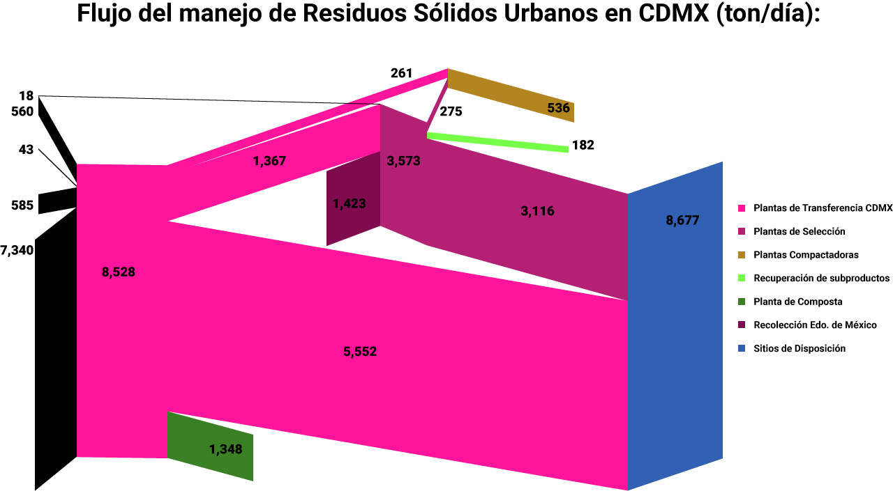
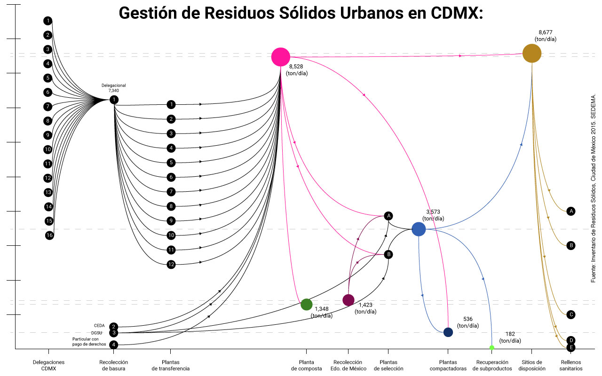
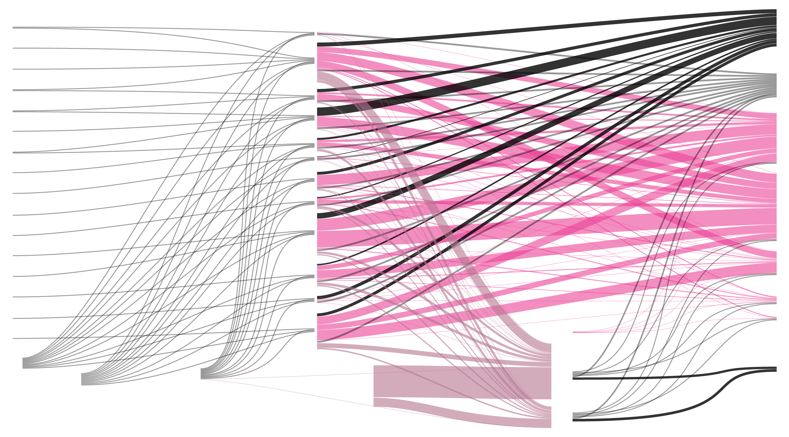

# README!

## Flujo de Residuos Sólidos Urbanos

### Universidad Autónoma Metropolitana

El flujo presenta la gestión que tienen los desechos sólidos de cada delegación (16) de la ciudad de México (CDMX), con base a la información recabada en el Inventario de Residuos Sólidos (2015) del reporte de la SEDEMA.  La forma del gráfico se inspiró al inicio con el sistema de flujo o mapa propuesto por Charles Minard (1869), presentando el movimiento, las pérdidas humanas y la temperatura ambiental durante la campaña de Napoleón contra Rusia en 1812. La dirección del flujo muestra que los residuos sólidos toman y convergen en diferentes etapas del proceso antes de ser o no reciclados.  Dentro del sistema se representan los ‘huecos de información’ como rutas o flujos en color negro y opacidad para diferenciar las\ngrandes relaciones que muestran las plantas de transferencia hacia los rellenos sanitarios de los que dispone la ciudad.  El color rosa (#ed419; 237, 65, 151, 153) guía el estilo institucional de CDMX. El color lila (#b67591; 181, 116, 145, 153) distingue las plantas de selección del sistema de disposición final.  El tamaño del gráfico hace visible y fácil de ubicar el imagotipo de cada delegación para la versión impresa y para la versión web permite reproducir el sistema de flujo interactivo desde cada ícono de la delegación.	

DGSU: Dirección General de Servicios Urbanos
CEDA: Central de Abastos
RME: Residuos de Manejo Especial

Referencias:  [Inventario de Residuos Sólidos, Ciudad de México 2015. SEDEMA](http://www.cms.sedema.cdmx.gob.mx/storage/app/media/IRS-2015-14-dic-2016.compressed.pdf)  [Guía de estilo básica para portales web de la Administración Pública de la Ciudad de México](http://www.cdmx.gob.mx/storage/app/media/Guia_Estilos_Sitios_Web_CDMX_v.1.3.pdf)  

Paragraphs are separated
by a blank line.

Two spaces at the end of a line leave a  
line break.

Text attributes _italic_, *italic*, __bold__, **bold**, `monospace`.

Horizontal rule:

---

Bullet list:

  * apples
  * oranges
  * pears

or

  - apples
  - oranges
  - pears

Numbered list:

  1. apples
  2. oranges
  3. pears

A [link](http://example.com).
