# flujo-de-residuos-solidos-cdmx


Guía rápida para clonar, instalar y ejecutar este repositorio localmente con VitePress.

[https://ciretorres.github.io/flujo-de-residuos-solidos-cdmx/](https://ciretorres.github.io/flujo-de-residuos-solidos-cdmx/)

## Requisitos

Antes de comenzar, asegúrate de tener instalado:

- [Node.js](https://nodejs.org/) 22 o superior. [Bun](https://bun.com/) v1.3.14 o superior.
- Git.
- Un editor de código, como Visual Studio Code.

Puedes comprobar las versiones instaladas con:

```sh
node --version
npm --version
bun --version
git --version
```

## Clona el repositorio

Clona el repositorio utilizando Git:

```sh
git clone https://github.com/ciretorres/flujo-de-residuos-solidos-cdmx.git
```

Accede a la carpeta del proyecto:

```sh
cd flujo-de-residuos-solidos-cdmx
```

## Instalar dependencias

Instala las dependencias definidas en `package.json`:

```sh
npm install # or pnpm install / yarn install / bun install
```

## Levantar el proyecto en local

Inicia el servidor de desarrollo:

```sh
npm run docs:dev # or pnpm docs:dev / yarn docs:dev / bun run docs:dev
```

Después, abre en el navegador:

```md
http://localhost:5173/flujo-de-residuos-solidos-cdmx
```

El servidor actualizará automáticamente la página cuando modifiques los archivos Markdown, Vue o de configuración.

## Summary

- [Introducción](#introducción)
- [Diseño](#diseño)
  - [Presentation](#presentation)
  - [Analysis](#snalysis)
  - [Exploration](#exploration)
  - [Redesign](#redesign)
- [Desarrollo](#desarrollo)
- [Acronyms & abbreviations](#acronyms_and_abbreviations)
- [Conclusiones](#conclusiones)
- [Referencias](#referencias)

## Introducción

The diagram illustrates the daily <b>Flow of the Urban Solid Waste System in México City</b> based on [Solid Waste's inventory](http://www.cms.sedema.cdmx.gob.mx/storage/app/media/IRS-2015-14-dic-2016.compressed.pdf) published by Secretaría del Medio Ambiente [(SEDEMA)](https://www.sedema.cdmx.gob.mx/programas/programa/residuos-solidos) in 2016.

This interactive visualization was made possible through a collaboration with the Design team from the seminar ["Problemas del diseño de información: cuantitiva"](./docs/public/bibliografia/OP-problemas-disenio-informacion-cuantitativa.pdf), taught by Proffesor [Nora Morales](https://uam-cuajimalpa.academia.edu/NoraMorales), and [Patricia Galán Lara](https://www.facebook.com/patricia.g.lara.75). The seminar took place as part of the Master's Degree in Information Design at [Cuajimalpa campus](http://cua.uam.mx/) of Universidad Autónoma Metropolitana in 2017.


How much urban solid waste flows through each processing station, according to the quantities published by SEDEMA?

As a reference, the [nodeWidth](https://www.npmjs.com/package/d3-sankey/v/0.7.1#sankey_links) of each station represents the amount of solid waste processed there, while the [stroke-width](https://www.npmjs.com/package/d3-sankey/v/0.7.1#sankey_links) of each Sankey link represents the amount of waste flowing through it, based on the available information.

The data were divided by ten—for example, 1,038.23 tons per day becomes 103.82—and then rounded down to the nearest integer. This is a temporary measure. The visualization uses a logarithmic scale. This allows us to test the tools I am using and evaluate how well they work with sufficiently large datasets.

If you are interested in working or collaborating with me, feel free to email me at erictorres.velasco@gmail.com.

Don’t forget to check out the code [here](https://github.com/ciretorres/flujo-de-residuos-solidos-cdmx/).

[Ir a summary](#summary)

## Diseño

The project initially began as an exploration of visual design and methods for representing quantities in relation to a social problem in the city, developed by curious minds in a course at the [Cuajimalpa campus](http://cua.uam.mx/) of Universidad Autónoma Metropolitana (UAM).

### Presentación

This is the versión 0.0.1-beta.1 in the early 2018.


This is the versión 0.0.2 in 2018.


This is the versión 0.0.3 in 2019.


The visualization in this project is intended to represent how urban solid waste is managed in each municipality before reaching its final destination in Mexico City.

This work builds on previous research conducted in collaboration with the Master’s Degree in Information Design team and Professor [Nora Morales](https://uam-cuajimalpa.academia.edu/NoraMorales), who guided us throughout the process.

[Ir a summary](#summary)

### Analysis

These are preliminary blueprints based on the quantitative information available we had, as well as on the interactions and movements we designed.

|                                                                               |                                                                                |                                                                                |
| ----------------------------------------------------------------------------- | ------------------------------------------------------------------------------ | ------------------------------------------------------------------------------ |
| 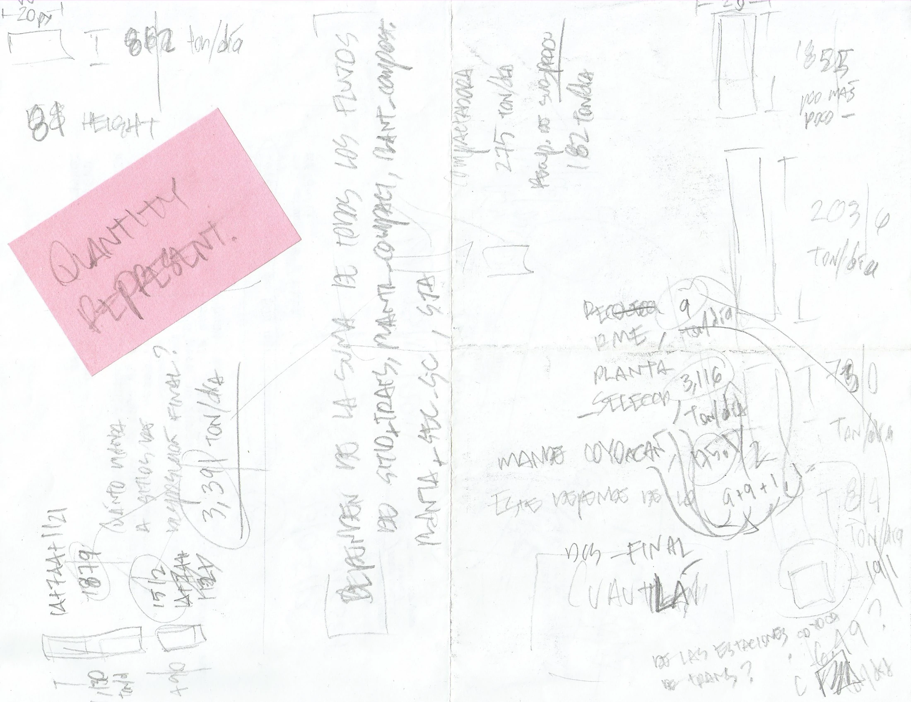 | 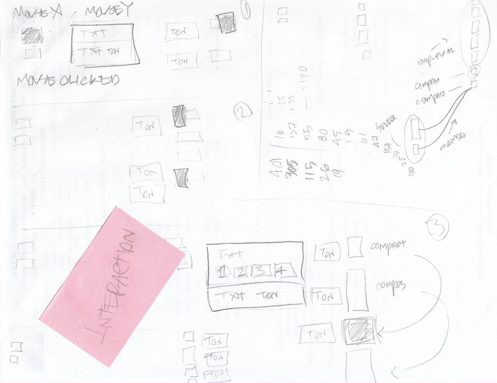 | 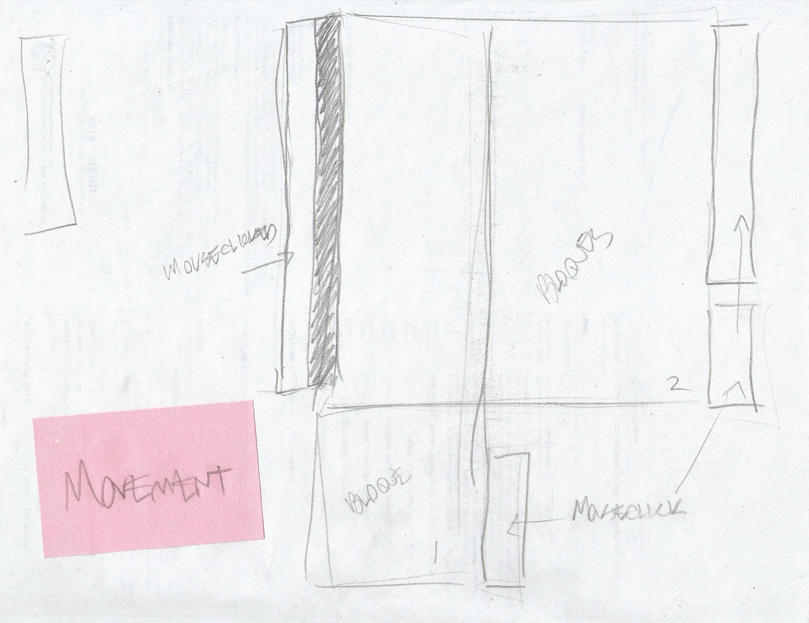 |

We decided to represent the visualization using a spatiotemporal structure (Meirelles, 2013), based on the dimensions inherent in the data.

Maps are commonly used to model spatial relationships and to understand or act upon geographic information. For this reason, the visual reconstruction of the flow incorporates the spatial properties of solid waste, such as its location. The quantity of waste is then transferred across different management points, and the values it takes on in each context are essential to understanding the process.

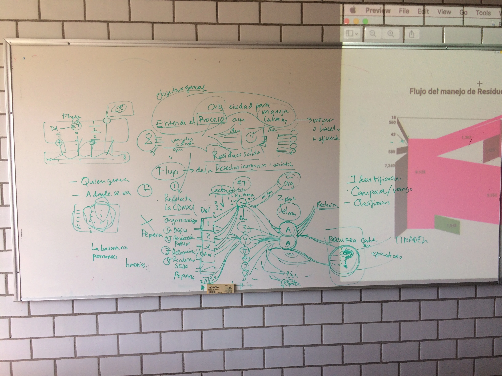

|                                                                                          |                                                                                          |                                                                                          |                                                                                          |
| ---------------------------------------------------------------------------------------- | ---------------------------------------------------------------------------------------- | ---------------------------------------------------------------------------------------- | ---------------------------------------------------------------------------------------- |
|  |  |  |  |
|  | 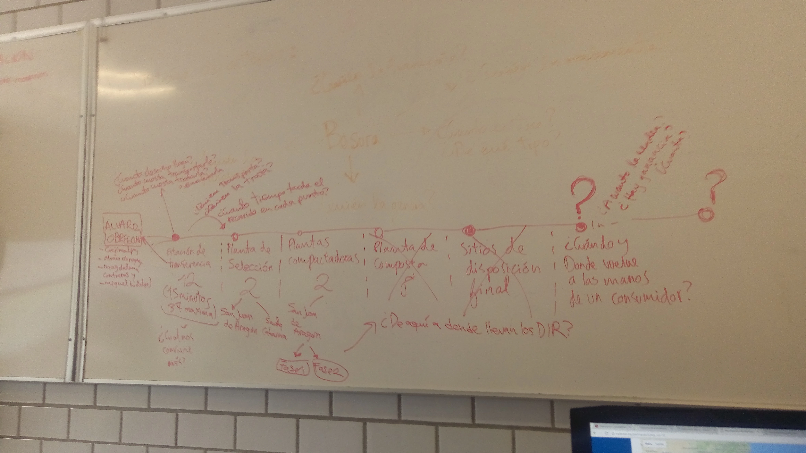     | 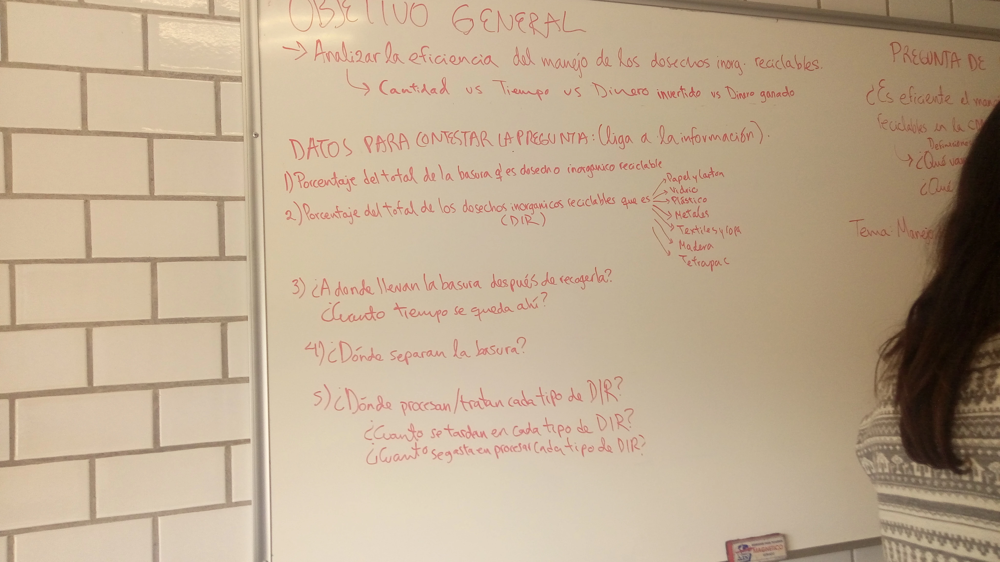     | 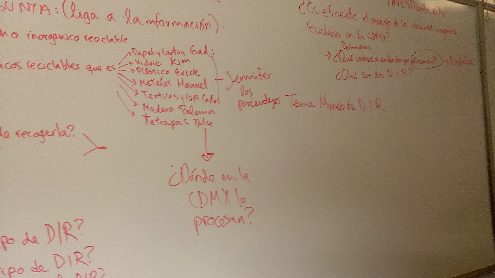     |

[Ir a summary](#summary)

### Exploration

In 1869, Charles Minard designed a flow map depicting Napoleon’s march to and from Russia in 1812–1813. The map combines statistical data, a timeline, and spatiotemporal information about the French army.

In the flow map, the **width of the line represents the number of soldiers marching** to and from Russia, with **each millimeter representing 10,000 men**.

The march begins with 420,000 men at the Polish–Russian border, shown by the beige line on the left. The army reaches Moscow with 100,000 men, shown at the top right, and returns with only 10,000 men, represented by the black line.

**The graph at the bottom represents the temperatures** recorded by the army during its return to Poland. These temperatures are aligned with the line representing the return journey.

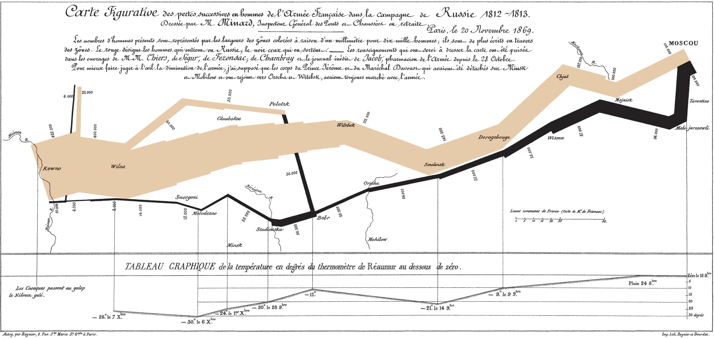

"Connections between temperatures and the march offer new levels of information: the relationships between deaths and low temperatures (probably also aggravated by fatigue). For example, 22,000 men died crossing the River Berezina due to the extreme low temperatures (–20°C [–4°F])" (Meirelles, 2013:162).

[Ir a summary](#summary)

---

#### Graphic Digital Prototyping

Once we had collected the information, we needed to determine how to visualize it. First, however, we had to define the question we wanted to answer. Based on the [Solid Waste's inventory](http://www.cms.sedema.cdmx.gob.mx/storage/app/media/IRS-2015-14-dic-2016.compressed.pdf), we extracted the values for each site mentioned in the document and represented them using different figures and shapes.

#### Prototype I:

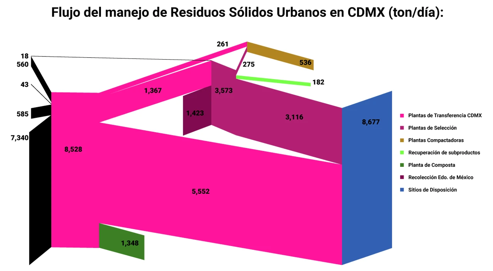

#### Prototype II:

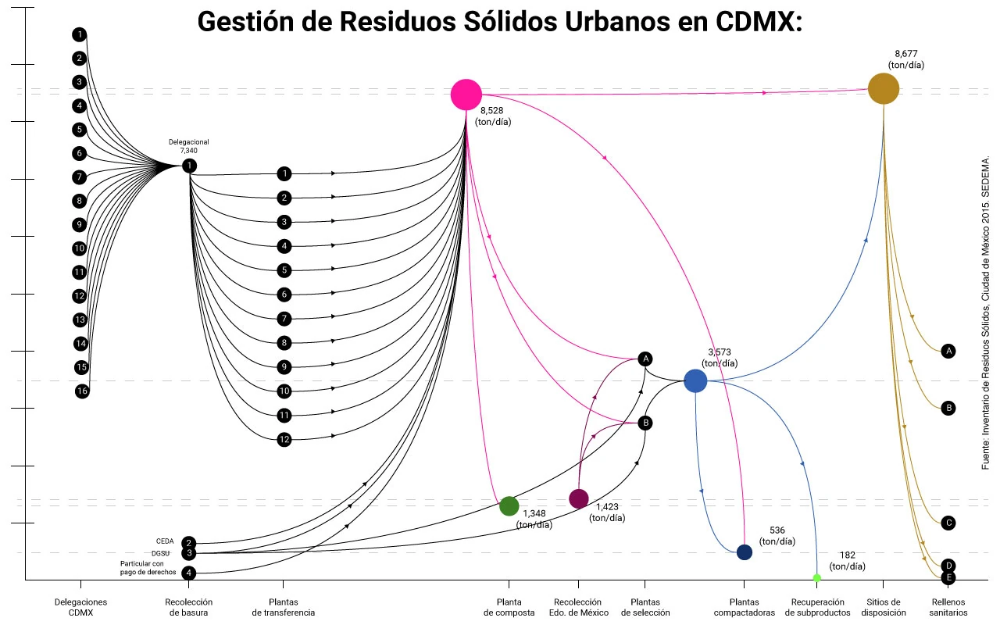

After that, we noticed that some quantities were not specified in the inventory. That is why we decided to break down the system and begin measuring the amount of solid waste processed at each site.

#### Prototype III:

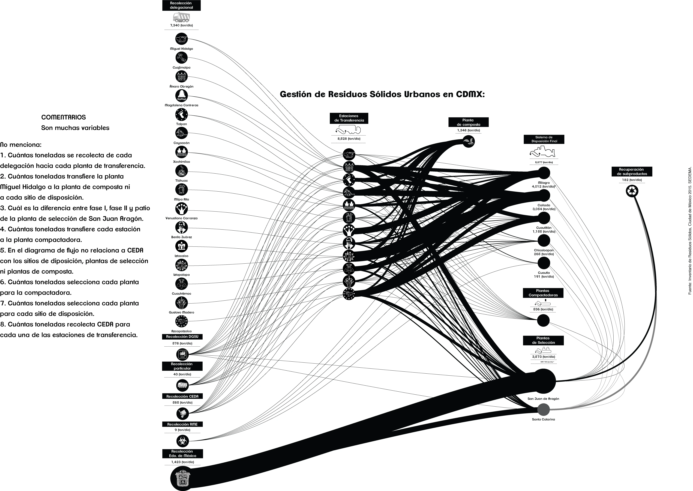

Ultimately, a few changes to the visual representation and color scheme allowed us to gain a broader understanding of the system’s complexity. This motivated me to take the project to the next stage of prototyping and analyze its logical structure from a semantic perspective.

#### Prototype IV:

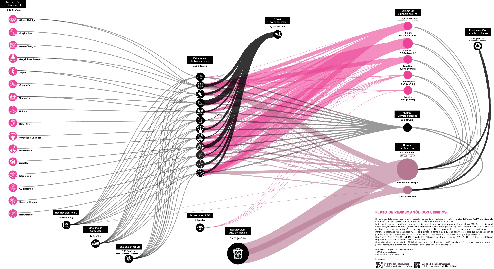

This reasoning led me to work with another technology in order to design a representation of these aspects and continue exploring the physical form they might take, as well as how they could be understood through interactive tools. The image above was presented at an exhibition at the [Cuajimalpa campus](http://cua.uam.mx/) of Universidad Autónoma Metropolitana (UAM).

It was exhibited alongside a series of other works designed by the team, which together helped communicate the system as a whole. In this visualization, each municipality was represented by its corresponding imagotype in the printed version.

[Ir a summary](#summary)

---

### Redesign

In 1898, Matthew Henry Phineas Riall Sankey introduced a diagram as a visual tool for representing the thermal efficiency of steam engines. In Sankey diagrams, **the width of each band is proportional to the corresponding quantity of steam flow**.

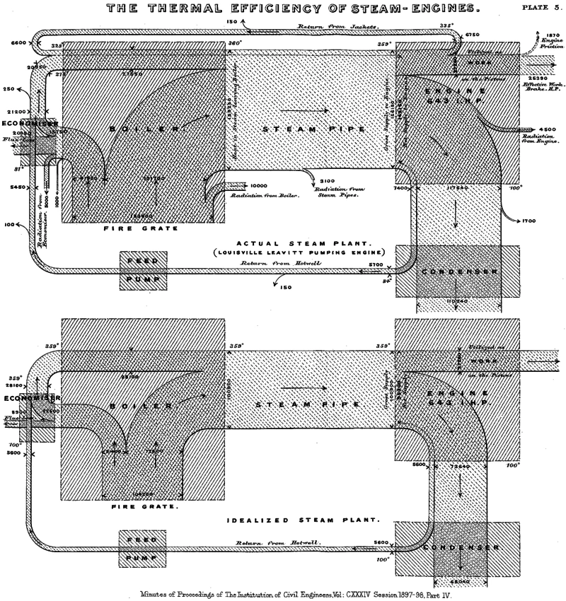

Flows in Sankey diagrams behave more like rivers than threads, since they do not retain a visual memory of their previous steps. This can be useful when users are more interested in comparing relationships across different data dimensions than in organizing the visualization around a single primary dimension.

[Ir a summary](#summary)

---

#### Fineo Density

Fineo Density is a visualization technique for representing continuous data flows based on the structure of Sankey diagrams. It is designed to represent relationships within multidimensional categorical data. Fineo has a network structure in which nodes represent individual categories grouped by dimension, while flow lines represent the connections between them. These connections are grouped at each level, thereby determining the width of the bands between pairs of axes.

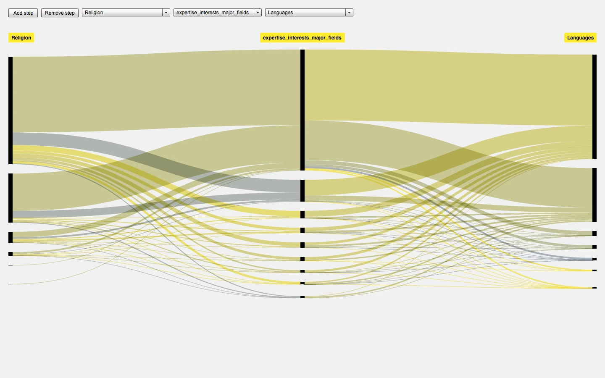

Inspired by this approach, I decided to code the flow structure of the diagram using the information collected previously. My goal was to determine how much urban solid waste was transferred from each processing site and represent these flows by category. Before coding the visualization, I adjusted the graphic prototype in Adobe Illustrator to ensure that the line widths accurately reflected the corresponding quantities.

#### Adjustments to graphic prototype of all the links

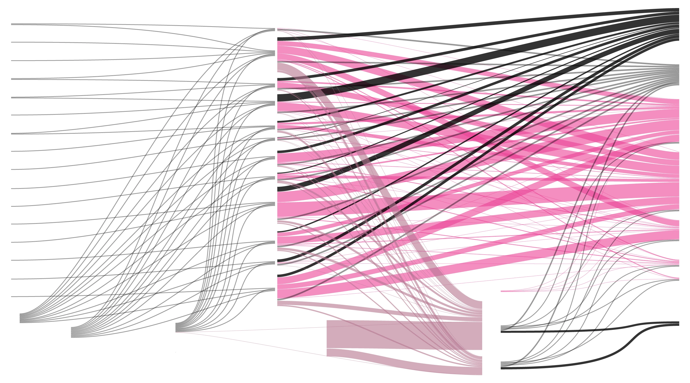

It is important to note that the colors of the lines were selected according to the [Basic Style Guide for Mexico City Public Administration Websites](<(http://www.cdmx.gob.mx/storage/app/media/Guia_Estilos_Sitios_Web_CDMX_v.1.3.pdf)>). For this reason, pink is the primary color, followed by purple, which distinguishes the sorting plants from the final disposal sites.

**Through this categorization process, we were finally able to identify gaps in the information provided by SEDEMA, including the lack of data indicating how much urban solid waste reaches the final disposal sites each day.**

The final result was a sketch-like prototype created in Processing, despite my limited familiarity with the tool at the time. This latest version was completed on June 1, 2018.

[Ir a summary](#summary)

## Desarrollo

## Acronyms_and_abbreviations

- **DGSU:** Dirección General de Servicios Urbanos
- **CEDA:** Central de Abastos
- **RME:** Residuos de Manejo Especial
- **CDMX:** Ciudad de México
- **RSU:** Residuos Sólidos Urbanos

[Ir a summary](#summary)

## Conclusiones

The management of urban solid waste is a complex system because of the variations among the information provided by public and private institutions, the regulations in place, social dynamics, and the sensory data used for decision-making.

These factors affect efficiency, management practices, indicator development, and patterns of consumption.

The question we asked ourselves was: Where are we heading as a society in this country? This question considers both the culture of recycling and the implementation of public policies in practice.

[Ir a summary](#summary)

## Referencias

- [Diagnostico-actual-flujo-residuos-solidos-urbanos-genera-cdmx.pdf](./docs/public/bibliografia/Diagnostico-actual-flujo-residuos-solidos-urbanos-genera-cdmx.pdf)
- [Estaciones-transferencia-residuos-solidos-areas-urbanas.pdf](./docs/public/bibliografia/Estaciones-transferencia-residuos-solidos-areas-urbanas.pdf)
- [Fineo](http://www.densitydesign.org/research/fineo/)
- [https://densitydesign.org/2011/09/evaluating-social-politics-impact-with-fineo/](https://densitydesign.org/2011/09/evaluating-social-politics-impact-with-fineo/)
- [Fineo Live](http://fineo.densitydesign.org/custom/vis/index.php?tablename=set131487359439&submit=Visualize)
- [Guía de estilo básica para portales web de la Administración pública de la Ciudad de México.](https://www.cdmx.gob.mx/storage/app/media/Guia_Estilos_Sitios_Web_CDMX_v.1.3.pdf)
- [Guia-estilo-basica-portales-web-adminis-publica-cdmx-v.1.3.pdf](./docs/public/bibliografia/Guia-estilo-basica-portales-web-adminis-publica-cdmx-v.1.3.pdf)
- [Inventario de Residuos Sólidos de la Ciudad de México (2015) ](http://www.cms.sedema.cdmx.gob.mx/storage/app/media/IRS-2015-14-dic-2016.compressed.pdf)
- [SEDEMA-inventario-residuos-solidos-cdmx-2015.pdf](./docs/public/bibliografia/SEDEMA-inventario-residuos-solidos-cdmx-2015.pdf)
- [Meirelles, Isabelle. 2013. Design for information\_ an introduction to the histories, theories, and best practices behind effective visualizations. USA: Rockport Publishers.](https://archive.org/details/designforinforma0000meir)
- [Minutes of the Proceedings of the Institution of Civil Engineers. E-ISSN 1753-7843. Volume 134 Issue 1898, 1898, pp. 278-312. PART 4](http://www.icevirtuallibrary.com/doi/abs/10.1680/imotp.1898.19100)
- [Norma-ambiental-cdmx-2013.pdf](./docs/public/bibliografia/Norma-ambiental-cdmx-2013.pdf)
- [PGIRS-gaceta.pdf](./docs/public/bibliografia/PGIRS-gaceta.pdf)
- [Programa de Gestión Integral de los Residuos Sólidos para la Ciudad de México Inventario de Residuos Sólidos de la Ciudad de México (2015)](https://www.sedema.cdmx.gob.mx/programas/programa/residuos-%20%20%20%20%20%20%20%20%20%20%20%20%20%20solidos?fbclid=IwAR0KfyUlkjbDuTNzDUCjQT0wtPlCT6b7TuXLRbaKbR3dHC0eisK33lvuUBg)
- [SEDEMA-programa-gestion-integral-residuos-solidos-2016-2020.pdf](./docs/public/bibliografia/SEDEMA-programa-gestion-integral-residuos-solidos-2016-2020.pdf)
- [Sankey-Diagrams](http://www.sankey-diagrams.com/)
- [Schmidt, Mario. Der Einsatz von Sankey-Diagrammen im Stoffstrommanagement (2006)](https://www.econstor.eu/bitstream/10419/97580/1/786508884.pdf)
- [Schmidt, Mario. The Sankey Diagram in Energy and Material Flow Management. Part I: History (2008)](http://onlinelibrary.wiley.com/doi/10.1111/j.1530-9290.2008.00004.x/full=)
- [SEMARNAT-directorio-centros-acopio-materiales-provenientes-residuos-solidos-mexico-2010.pdf](./docs/public/bibliografia/SEMARNAT-directorio-centros-acopio-materiales-provenientes-residuos-solidos-mexico-2010.pdf)

[Ir a summary](#summary)
