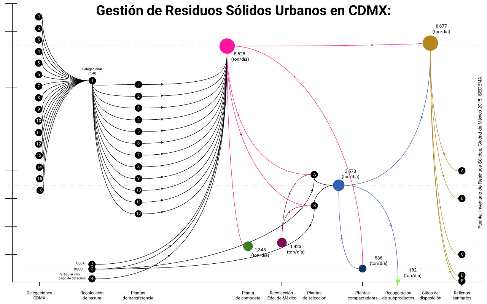
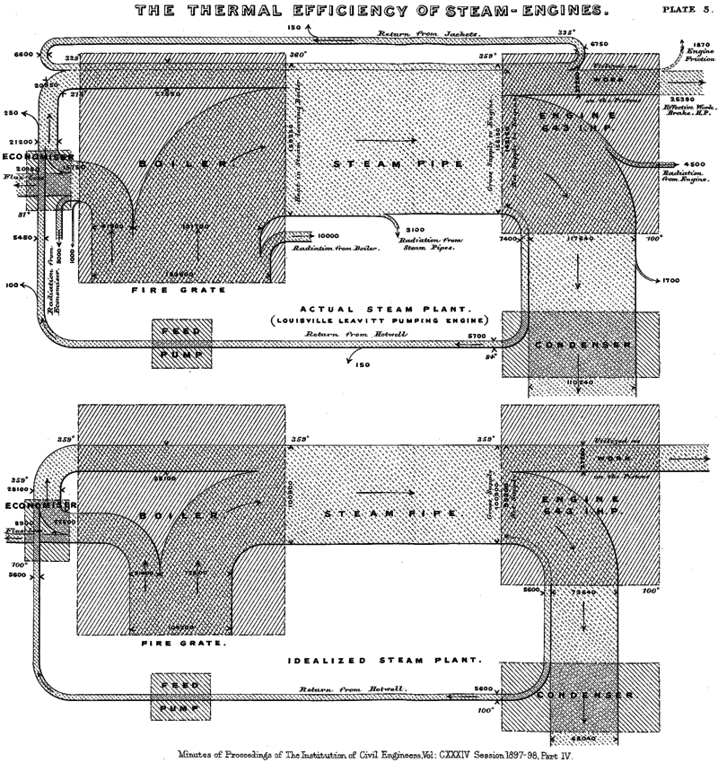
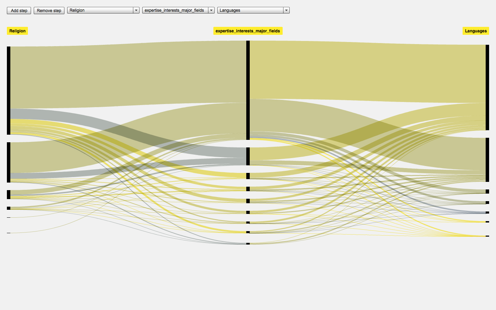

<documentacion />

# Documentación: interactive interface of the Urban Solid Wastes system in Mexico City (CDMX)

## Introducción

The Interactive visual interface presents the flow diagram system from the Urban Solid Waste in Mexico City (CDMX), according with [Solid Waste's inventory](http://www.cms.sedema.cdmx.gob.mx/storage/app/media/IRS-2015-14-dic-2016.compressed.pdf) published in 2016 by Secretaría del Medio Ambiente (SEDEMA).

The job is been made possible in collaboration with the Design team at the ["Problemas del diseño de información: cuantitiva"](../.vitepress/public/bibliografia/OP-problemas-disenio-informacion-cuantitativa.pdf) seminar with proffesor [Nora Morales](http://noramorales.academia.edu/), for the Master in Information Design at Universidad Autónoma Metropolitana - campus [Cuajimalpa](http://cua.uam.mx/) in 2017 and [Patricia Galán Lara](https://www.facebook.com/patricia.g.lara.75).

How many Urban Solid Waste flows through each process station according with the quantities published by SEDEMA?

As a reference, the [strokeWeight](https://processing.org/reference/strokeWeight_.html) of each pipeline represents the quantity of solid waste, according with the information available.

The data was scaled divide between ten (e.g. 1,038.23 ton/day, to obtain 103.82 and take only the integer value. For now). This es logarithm scale.
With this, we can trial the tools, that i'm using, to measure how they work with sufficienctly.

If you are interested in work together or colaborate, send me a whatsapp 5547904238, or feel free to mail me at erictorres.velasco@gmail.com

Don't forget to check the code [here](https://github.com/ciretorres/flujo-de-residuos-solidos-cdmx/).
Last update: **11/2023**

## Summary

- [Diseño](#diseño)
  - [Presentation](#presentation)
  - [Analysis](#snalysis)
  - [Exploration](#exploration)
  - [Redesign](#redesign)
- [Desarrollo](#desarrollo)
- [Acronyms & abbreviations](#acronyms_and_abbreviations)
- [Conclusiones](#conclusiones)
- [Referencias](#referencias)

## Diseño

Initially, the project began with the purpose to explore with visual design and quantity representation structures regarding a social problem in the city with a nine understanding minds at class in Universidad Autónoma Metropolitana (UAM), campus [Cuajimalpa](http://cua.uam.mx/).

### Presentación

This is the versión 0.0.1-beta.1 in the early 2018.

This is the versión 0.0.2 in 2018.

This is the versión 0.0.3 in 2019.

The visualization in this project intented to represent the management from the Urban Solid Waste of each municipality to the final destination site in México City.

All this with respect to the previous research in collaboration with the team Master degree in Information Design and proffesor [Nora Morales](http://noramorales.academia.edu/) who guided us into the process.

[Go top](#Summary)

### Analysis

This are like blueprints made from the quantity information we had, the interaction and movement we made:

|                                                               |                                                                |                                                                |
| ------------------------------------------------------------- | -------------------------------------------------------------- | -------------------------------------------------------------- |
|  |  |  |

We decided to represent the visualization with a spatio-temporal structure (Meirelles, 2013), because of the type of dimention that the information naturally has been used.

Commonly, we use maps for modelling the rational relation space, and for taking action about the geography. Thus, this visual flow reconstruction came in with the solid waste properties (e.g. location). The quantity is transferred to different management points and the values that acquires in each context are essentials.

|                                                             |                                                                      |                                                                      |                                                                      |
| ----------------------------------------------------------- | -------------------------------------------------------------------- | -------------------------------------------------------------------- | -------------------------------------------------------------------- |
|  |           |           |           |
|  |  |  |  |

[Go top](#Summary)

### Exploration

In 1869, Charles Minard designed a flow map which displays the Napoleon's March to and from Russia, 1812-1813, and combines statistical data techniques with a timeline, and spatio-temporal information about the French army, the **line width represents the number of soldiers marching** to and from Russia, with **each millimeter standing for 10,000 men**.

The march starts with 420,000 men in the Polish–Russian border (center left, beige line), reaches Moscow with 100,000 (top right), and ends with 10,000 men (black line). **The line graph at the bottom represents the temperatures** faced by the army on the way back to Poland, which are associated with the line standing for the return trip.

"Connections between temperatures and the march offer new levels of information: the relationships between deaths and low temperatures (probably also aggravated by fatigue). For example, 22,000 men died crossing the River Berezina due to the extreme low temperatures (–20°C [–4°F])".

---

#### Graphic Digital Prototyping

With the information recollected, we needed to figure out how to visualize it. But first, we had to define which question is going to be answer. So, according with the [Solid Waste's inventory](http://www.cms.sedema.cdmx.gob.mx/storage/app/media/IRS-2015-14-dic-2016.compressed.pdf), we tried to catch each value from every site mentioned in the document and draw this numbers in relation with figures and shapes.

#### Prototype I:

#### Prototype II:

After that, we noticed that there where some unknown quantities didn't mention in the inventory. Thats why, we decided to descomposed the system and started taking the measure for every site which process the solid waste.

#### Prototype III:

Ending, with a few changes in representation and color style. We could finally comprehended something bigger and more complex, that motived me to take it to the next level of prototyping and started to understanding its logic structure from the semantic point of view.

#### Prototype IV:

That reasoning, set me on working with another techonology to design a represent this kinds of aspects to keep speculating about the physical form that could be naturally understand through some interactive helping tools. The image above was used to be presented in an exhibition at Universidad Autónoma Metropolitana (UAM), campus [Cuajimalpa](http://cua.uam.mx/).

With a serie of others works designed by the team, that integrated the comprehension of the whole system. In this visualization, each municipality was referred to its imagotype for the print version.

[Go top](#Summary)

---

### Redesign

In 1968, Riall Sankey proposed a diagram as a visual representation tool for talking about thermal effiency in the vapor machines. In Sankey's diagrams **the widths of bands are scaled to the corresponding quantities of the vapor flow**.

Flows in Sankey diagrams act much more like 'rivers' (as opposed to threads) in which you lose memory of the previous steps. This can be useful in thoses cases in which the user is more interested in relating different data dimensions next to each other more than centering the visualization partition arround a leading dimension.

---

#### Fineo Density

Fineo Density is visualization technique of continuous flow of data based on Sankey diagram structure, to represent relations between multidimensional categorical data. Fineo has a network structure, where nodes are individual categories grouped under a dimension, with the flow lines representing connections. Connections are grouped at every level, thus providing the width between pairs of axes.

With this inspiration in mind, I decided to code the diagram flow structure with the information available used previously, to find how much urban solid waste is transferred from every process site and relate as a category. So first, I had to make some adjustments in adobe illustrator to the graphic visualization prototype to respect every width of the lines.

#### Adjustments to graphic prototype of all the links

It is relevant to mention, that the color for the lines was used acoording to the [Basic style guide for the Public Administration web sites of Mexico City](http://www.cdmx.gob.mx/storage/app/media/Guia_Estilos_Sitios_Web_CDMX_v.1.3.pdf). That's why the pink is the main color, after the purple that distinguish the selection plants from the final dispotition sites.

With this categorization process, we could finally viewed the gaps that the information presented by SEDEMA has. Without mention, how many urban solid waste quantity ends every day at the final disposition sites.

Finally, the result, with a few problems with the knowledge about the tool, was a sketching prototype made in Processing. With this last update in 01/06/2018.

[Go top](#Summary)

## Desarrollo

## Acronyms_and_abbreviations

**DGSU:** Dirección General de Servicios Urbanos  
**CEDA:** Central de Abastos  
**RME:** Residuos de Manejo Especial  
**CDMX:** Ciudad de México  
**RSU:** Residuos Sólidos Urbanos

[Go top](#Summary)

## Conclusiones

The management of Urban Solid Waste is a complex system, because there are variants between the information provided by public and private institutions, regulations, social dinamics and sensory data for decision making that involves efficiency, management and indicators production, and quantity consumption.

The question that we asked ourselves is, where are going as a society in this country? Considering the culture of recyling and the excersive of policies that are follow into the straight.

## Referencias

[Programa de Gestión Integral de los Residuos Sólidos para la Ciudad de México Inventario de Residuos Sólidos de la Ciudad de México (2015)](https://www.sedema.cdmx.gob.mx/programas/programa/residuos-%20%20%20%20%20%20%20%20%20%20%20%20%20%20solidos?fbclid=IwAR0KfyUlkjbDuTNzDUCjQT0wtPlCT6b7TuXLRbaKbR3dHC0eisK33lvuUBg)

[Inventario de Residuos Sólidos de la Ciudad de México (2015) ](http://www.cms.sedema.cdmx.gob.mx/storage/app/media/IRS-2015-14-dic-2016.compressed.pdf)

[Guía de estilo básica para portales web de la Administración pública de la Ciudad de México.](https://www.cdmx.gob.mx/storage/app/media/Guia_Estilos_Sitios_Web_CDMX_v.1.3.pdf)

[Schmidt, Mario. Der Einsatz von Sankey-Diagrammen im Stoffstrommanagement (2006)](https://www.econstor.eu/bitstream/10419/97580/1/786508884.pdf)

[Schmidt, Mario. The Sankey Diagram in Energy and Material Flow Management. Part I: History (2008)](http://onlinelibrary.wiley.com/doi/10.1111/j.1530-9290.2008.00004.x/full=)

[Minutes of the Proceedings of the Institution of Civil Engineers. E-ISSN 1753-7843. Volume 134 Issue 1898, 1898, pp. 278-312. PART 4](http://www.icevirtuallibrary.com/doi/abs/10.1680/imotp.1898.19100)

[Sankey-Diagrams](http://www.sankey-diagrams.com/)

[Fineo](http://www.densitydesign.org/research/fineo/)

[Fineo Live](http://fineo.densitydesign.org/custom/vis/index.php?tablename=set131487359439&submit=Visualize)

[Meirelles, Isabelle. 2013. Design for information\_ an introduction to the histories, theories, and best practices behind effective visualizations. USA: Rockport Publishers.](../.vitepress/public/bibliografi/libro.pdf)

[SEDEMA-inventario-residuos-solidos-cdmx-2015.pdf](../.vitepress/public/bibliografia/SEDEMA-inventario-residuos-solidos-cdmx-2015.pdf)

[Guia-estilo-basica-portales-web-adminis-publica-cdmx-v.1.3.pdf](../.vitepress/public/bibliografia/Guia-estilo-basica-portales-web-adminis-publica-cdmx-v.1.3.pdf)

[SEDEMA-programa-gestion-integral-residuos-solidos-2016-2020.pdf](../.vitepress/public/bibliografia/SEDEMA-programa-gestion-integral-residuos-solidos-2016-2020.pdf)

[PGIRS_Gaceta.pdf](../.vitepress/public/bibliografia/PGIRS_Gaceta.pdf)

[Norma-ambiental-cdmx-2013.pdf](../.vitepress/public/bibliografia/Norma-ambiental-cdmx-2013.pdf)

[Diagnostico-actual-flujo-residuos-solidos-urbanos-genera-cdmx.pdf](../.vitepress/public/bibliografia/Diagnostico-actual-flujo-residuos-solidos-urbanos-genera-cdmx.pdf)

[ESTACIONES_DE_TRANSFERENCIA.pdf](../.vitepress/public/bibliografia/ESTACIONES_DE_TRANSFERENCIA.pdf)

[SEMARNAT-directorio-centros-acopio-materiales-provenientes-residuos-solidos-mexico-2010.pdf](../.vitepress/public/bibliografia/SEMARNAT-directorio-centros-acopio-materiales-provenientes-residuos-solidos-mexico-2010.pdf)

[Go top](#Summary)

---
